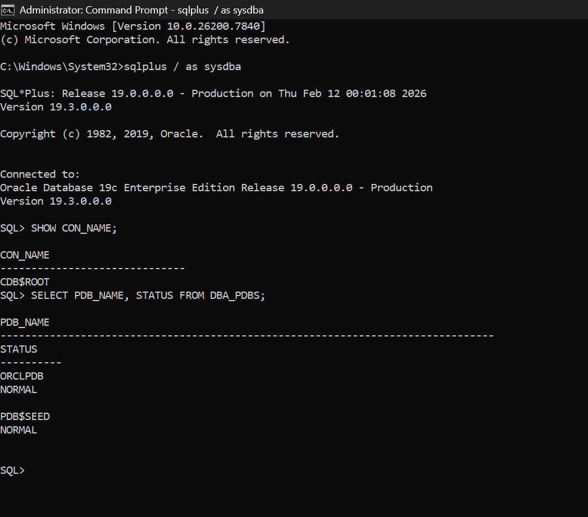
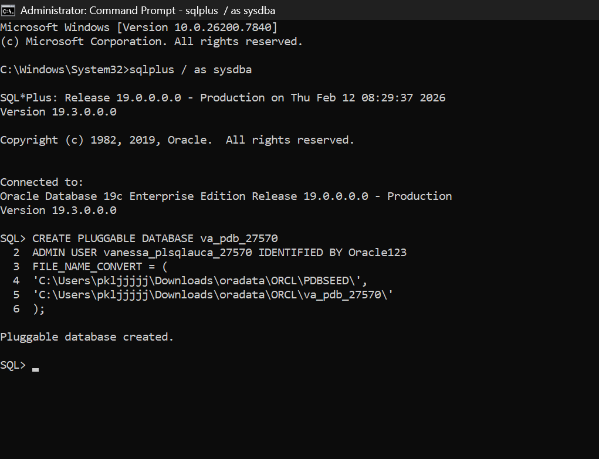
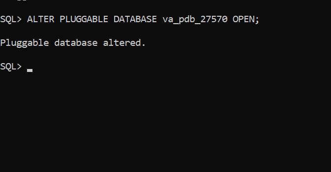
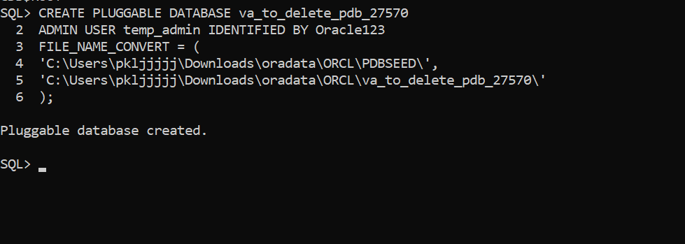
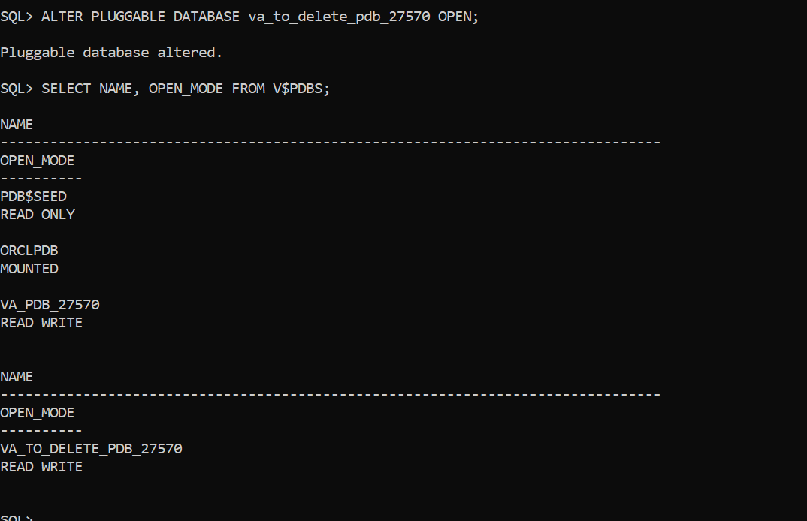
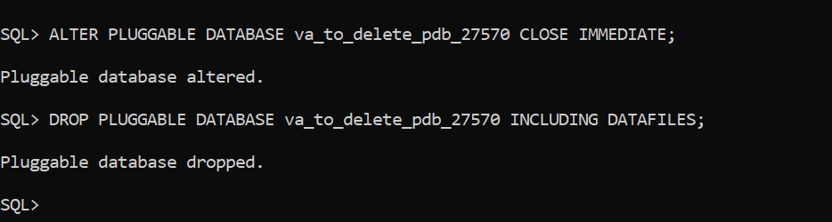
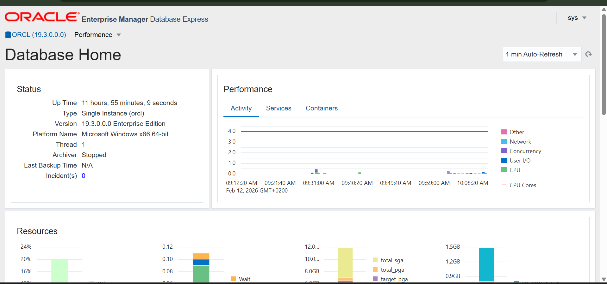

# Oracle PDB Assignment II - Vanessa 27570

## Overview
This repository contains my practical work for **Oracle Pluggable Database (PDB) Management**, as part of the INSY 8311 course. The purpose of this assignment is to demonstrate skills in creating, managing, and deleting PDBs, as well as using Oracle Enterprise Manager (OEM).

## Oracle Environment
- Oracle Database 19c (19.3.0.0.0) Enterprise Edition  
- Windows 10 x64  
- SQL*Plus and Oracle Enterprise Manager Express (EM Express)

---

## Task 1: Create a New Pluggable Database

**PDB Name:** `VA_PDB_27570`  
**User inside PDB:** `VANESSA_PLSQLAUCA_27570`  
**Password:** `Oracle123`

**Steps performed:**
1. Checked existing PDBs.
2. Created new PDB using `CREATE PLUGGABLE DATABASE`.
3. Opened the PDB.
4. Created user inside the PDB.

**Screenshots:**
-   
-   
-   

---

## Task 2: Create and Delete a Temporary PDB

**Temporary PDB Name:** `VA_TO_DELETE_PDB_27570`  

**Steps performed:**
1. Checked container before creating temporary PDB.  
   -   
2. Created temporary PDB.  
   -   
3. Opened temporary PDB to confirm creation.  
   -   
4. Dropped temporary PDB completely.  
   -   
   -   

---

## Task 3: Oracle Enterprise Manager (OEM)

**Steps performed:**
1. Opened EM Express via browser: `https://localhost:5500/em`  
2. Logged in using:  
   - Username: `sys`  
   - Password: `Oracle123`  
   - Connect As: `SYSDBA`  
   - Container: `CDB$ROOT`  
3. Confirmed database environment and status.

**Screenshot:**  
-   

---

## Challenges Faced
 
- SYS user password was initially unknown; had to reset it.  
er.  
- PDB not immediately visible in EM Express; had to rely on SQL*Plus verification.

---

## Integrity Statement
I confirm that all work in this repository is my own and reflects my **individual effort**, following the course’s academic integrity guidelines.

---
